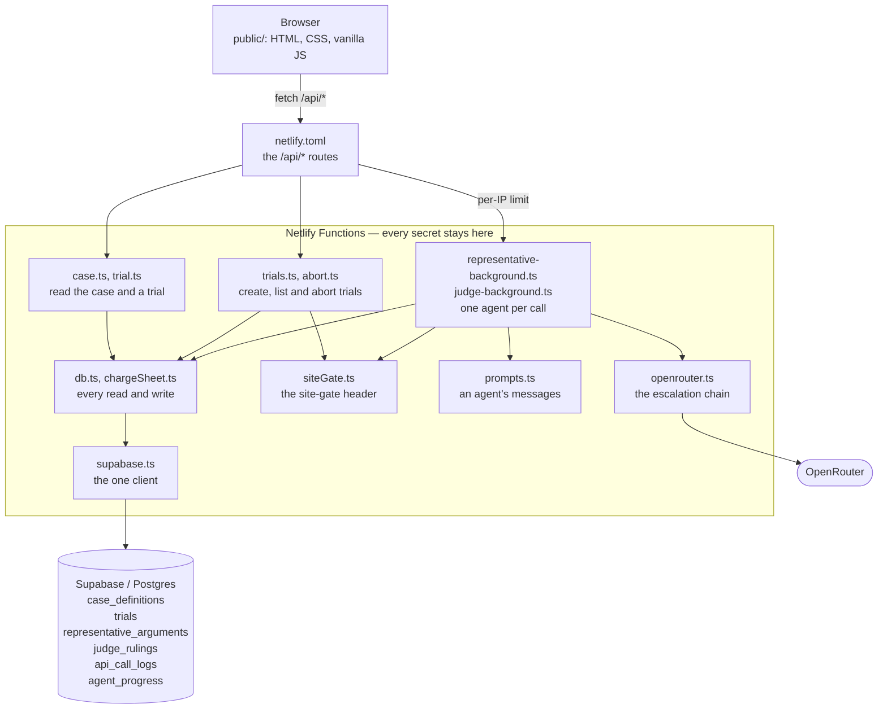

# Tribunal

### ▶ Live app: **https://tribunal-t001.netlify.app**


*Three judges, three separate rulings: the Elon judge found the killing
justified, the Barak and Shamgar judges did not, and nothing on the page adds
them up. Grey Worm's argument was answered by `claude-haiku-4.5` rather than
the default model: his first two attempts were caught and discarded, and [the
escalation chain](#the-escalation-chain) moved him up a tier.*

A fixed, canonical fictional tribunal — **Case T-001: The Realm v. Jon Snow** —
argued and ruled on by seven independent AI agents: four representatives (two
defense, two prosecution) and three judges, each modelled on a distinct real
judicial reasoning method (Aharon Barak, Menachem Elon, Meir Shamgar).

The Tribunal decides one question — **justified / not justified** — and gives
reasons. It does not impose a sentence, and the three judges' rulings are never
combined into a single verdict; they are displayed independently, each on its
own card.

## Architecture

Three-tier: browser (static HTML/CSS/vanilla JS, no build step or framework) →
backend (Netlify Functions, TypeScript, bundled by esbuild) → database
(Supabase/Postgres).

The backend holds the OpenRouter API key and orchestrates every model call. The
database stores:

- the case record, each trial, and every representative argument and judge
  ruling;
- a full per-call log (role, model, tokens, cost, status, duration, timestamp,
  and the model's reply word for word, kept for audit);
- and the attempt each running call is on.

### What talks to what



**What the picture claims**, each held to the code by
[`tests/docs.test.js`](tests/docs.test.js):

- **The browser has one way in.** Every request [`app.js`](public/app.js) makes
  goes to a route under /api/ on the site itself, served through the redirects
  in [`netlify.toml`](netlify.toml), and [`index.html`](public/index.html) loads
  nothing from another host. There is no line from the browser to OpenRouter or
  to the database because there is no such call.
- **Each secret is read in one module:** the OpenRouter key only in
  [`openrouter.ts`](netlify/functions/lib/openrouter.ts), and the Supabase URL
  and key only in [`supabase.ts`](netlify/functions/lib/supabase.ts). Both come
  from Netlify's environment variables and never reach the browser. The
  site-gate token in [`app.js`](public/app.js) is the one value the page sends
  for the backend to check, and it is no secret (see [Anti-abuse and cost
  controls](#anti-abuse-and-cost-controls)).
- **Only the two agent functions reach OpenRouter**, and only through
  [`openrouter.ts`](netlify/functions/lib/openrouter.ts), which makes the
  backend's one outgoing request. The functions that read, create, list or
  abort trials cannot spend quota.
- **Every database access goes through [`db.ts`](netlify/functions/lib/db.ts)
  or [`chargeSheet.ts`](netlify/functions/lib/chargeSheet.ts)**, the only
  modules that import [`supabase.ts`](netlify/functions/lib/supabase.ts), where
  the one client is made with the service-role key (see [Database](#database)
  for what the tables let other keys do).
- **The site gate is checked by every function that creates or aborts a trial
  or starts an agent**, through
  [`siteGate.ts`](netlify/functions/lib/siteGate.ts);
  [`case.ts`](netlify/functions/case.ts) and
  [`trial.ts`](netlify/functions/trial.ts), which only read, do not import it.
- **The per-IP limit sits on the routes, not in the code:**
  [`netlify.toml`](netlify.toml) sets it on the two agent routes only, and each
  agent function refuses a request that did not come through its route on the
  site's main address, through
  [`extractParams.ts`](netlify/functions/lib/extractParams.ts).
- **Not drawn:** the helper modules
  [`extractParams.ts`](netlify/functions/lib/extractParams.ts),
  [`judges.ts`](netlify/functions/lib/judges.ts),
  [`models.ts`](netlify/functions/lib/models.ts),
  [`pricing.ts`](netlify/functions/lib/pricing.ts),
  [`representatives.ts`](netlify/functions/lib/representatives.ts),
  [`response.ts`](netlify/functions/lib/response.ts),
  [`safeHandler.ts`](netlify/functions/lib/safeHandler.ts) and
  [`types.ts`](netlify/functions/lib/types.ts), and the imports between the
  modules of [`netlify/functions/lib/`](netlify/functions/lib) other than those
  into [`supabase.ts`](netlify/functions/lib/supabase.ts). Every arrow between
  two modules is a real import, and every import from a function into a module
  drawn has its arrow.

### How a trial runs

- Four representatives run concurrently — they don't depend on each other.
  - Dispatch goes through a small worker pool, but because the [agent
    endpoints](#the-two-agent-endpoints) are [Background
    Functions](#background-functions-and-polling) that return as soon as the
    work is accepted, a pool slot frees at the trigger rather than at the end of
    the generation — so all four are genuinely in flight at the same time.
  - That is measured from the call log's own timings rather than assumed: of the
    41 trials measured on 2026-09-21, 36 had all four in flight at once, and in
    the other 5 a fast call had finished before the last one began. It has been
    so since 2026-08-29, when [the agent functions took their `-background`
    names](https://github.com/guycn1/tribunal/commit/14c0a455c1c17c0bd87d7d9c1703ca6d99eb382e).
  - What the pool still bounds is how many trigger requests overlap. Netlify's
    per-IP rate limit counts requests, not overlap, so a trial costs 7 against
    it either way.
- Three judges run after, each independently receiving the case record plus all
  four representative arguments (or however many are actually available — a
  failed representative call is never backfilled with invented text).
- A failed model call is logged as a visible failure and never produces a
  fabricated argument or ruling.


*Each judge reasons by its own method, visible in its opening lines: the Barak
judge announces "a structured, rights-centered analysis" and defines
"justified" and "necessary" before applying them; the Elon judge turns to a
principle of Jewish legal tradition, the rodef or pursuer; the Shamgar judge
sets out the governing standard and the institutional framework, then the
chronology. Three rulings, side by side, never combined.*

### Background Functions and polling

Representative and judge calls run as Netlify Background Functions rather than
standard synchronous invocations — a real generation can take far longer than a
synchronous function is allowed to run.

The browser triggers a call, gets an immediate `202`, and polls
[`GET /api/trials/:id`](#api-endpoints) until the result lands.

### The escalation chain

**A 4-tier model escalation chain** guards against unusable output:
`default model (2 attempts) → claude-haiku-4.5 (2 attempts) → a third model (2 attempts) → a last-resort model (1 attempt)`,
escalating once a tier has used up its attempts. The escalation signals are:

- `finish_reason === 'length'` (hit the token cap);
- two independent degeneration heuristics (a long punctuation-less run-on, and
  repetition, verbatim or near-verbatim: the same whole sentence twice in a row,
  a sentence of 18+ words twice, any sentence 3+ times, a passage of 3+
  sentences repeated word for word, the same clause twice in a row, a clause of
  6+ words 3 times close together, 2+ consecutive sentences found again almost
  word for word (80%+ alike, 10+ words), or a sentence in the last 10% that is
  60%+ like one of the 4 before it (8+ words each) — a clause being any stretch
  between commas, semicolons, colons or sentence ends, and two sentences'
  likeness the share of words that need no change to turn one into the other);
- a plain HTTP failure such as a removed model id (which skips the tier's
  remaining attempts, since re-asking a model that just 404'd is pointless);
- and transient failures (a timeout or network error, a 408, a 429, a 5xx, a 200
  with no content, or a reply an upstream error cut short).

Three failures end the call at once instead, since no retry can fix them:

- not enough credit for the request (HTTP 402 — what is left of the account's
  balance, or of the key's own spending limit, cannot cover it);
- a rate-limit window that outlasts the remaining time budget;
- and an OpenRouter key missing from the server's configuration.

Transient failures are split by **how long they took**, because the right
response differs:

- a call that bounces back in under 10 seconds (a burst rate limit, say) gets a
  bounded number of same-model retries that don't count against the tier's
  attempt budget — escalating to a costlier model within seconds of a rate limit
  that clears on its own would be exactly the wrong move;
- while one that takes 10 seconds or longer (a timeout that ran its whole
  ceiling, say) counts as a real failure of that tier, spending one of its
  attempts.

Per-attempt timeouts scale with both prompt size and the token cap, so a judge's
much larger prompt gets a larger ceiling.

Every tier in the chain is a paid model; none of them runs on a free tier. Tier
2 is significantly pricier than the default tier, which is why the chain is
built to exhaust the cheapest option before reaching for a better one — not to
avoid spending, but to spend proportionately.

Every discarded attempt — including a timeout — gets logged as its own real row
(model, tokens, cost, duration, outcome, and the reply if there was one) the
moment it's decided, not batched at the end, so the call log shows the whole
path rather than only the final result.

A live-in-progress card shows the model and attempt actually running right now,
updating as the chain escalates.

### Aborting a trial

**Abort stops server-side work, not just the UI.** A [Background
Function](#background-functions-and-polling) can't be cancelled by the browser
that started it, so the trial's abort is recorded in the database and each
in-flight call checks for it before every attempt and as each attempt ends, and
stops itself, rather than continuing to escalate through pricier models for a
result nobody is waiting for.

A request already sent is left to finish: this app does not stream, and
[OpenRouter's docs](https://openrouter.ai/docs/api/reference/streaming) say a
non-streamed request is billed in full even if it is cancelled (as read on
2026-10-05). So the attempt that was running is logged as what it was, marked
[`aborted`](#call-log) — a failed one is not retried, and a finished reply is
not saved.

### Anti-abuse and cost controls

**Anti-abuse / cost controls**, layered since the deployed site runs on a paid
model with no login:

- a site-wide rolling call cap;
- per-IP rate limiting on the two routes that spend OpenRouter quota, the only
  way the agent functions accept a request;
- and a lightweight site-gate header that filters traffic that never loaded the
  page at all.

### API endpoints

Each route below is a rewrite in [`netlify.toml`](netlify.toml) to one function
in [`netlify/functions/`](netlify/functions), named at the start of its
description. Everything this app's own code returns is JSON.

- <code><b>GET</b>  /api/case</code>\
  [`case.ts`](netlify/functions/case.ts): The fixed case record, the starting
  model for each role, and the shared completion-token cap. Read once when the
  page loads.
- <code><b>GET</b>  /api/trials</code>\
  [`trials.ts`](netlify/functions/trials.ts): The 50 most recent trials, newest
  first, for the run-history sidebar — each with its status, how many of its 7
  results were saved, whether it was aborted, and whether any of its call-log
  rows is stored as `failed` (a failed attempt, recovered or not, or a row an
  abort wrote).
- <code><b>POST</b> /api/trials</code>\
  [`trials.ts`](netlify/functions/trials.ts): Creates a trial and returns it
  with the case record (`201`). Needs the site-gate header. Makes no model call.
- <code><b>GET</b>  /api/trials/:id</code>\
  [`trial.ts`](netlify/functions/trial.ts): Everything recorded for one trial:
  the trial itself, the case record, its saved arguments and rulings, every
  call-log row (oldest first, without the stored reply text), and the attempt
  each role most recently started. Polled throughout a run, and read once to
  open a past trial. `404` for an unknown id.
- <code><b>POST</b> /api/trials/:id/representatives/:role</code>\
  [`representative-background.ts`](netlify/functions/representative-background.ts):
  Runs one representative through [the escalation
  chain](#the-escalation-chain) and saves the argument, unless the trial has
  been aborted meanwhile.
- <code><b>POST</b> /api/trials/:id/judges/:role</code>\
  [`judge-background.ts`](netlify/functions/judge-background.ts): Runs one judge
  on the case record plus whichever representative arguments were saved, and
  saves the ruling, unless the trial has been aborted meanwhile. Marks the trial
  completed once every judge has a final outcome.
- <code><b>POST</b> /api/trials/:id/abort</code>\
  [`abort.ts`](netlify/functions/abort.ts): Takes `{ "roles": [...] }` — the
  roles still pending — records an abort for each one it recognises, at most
  once per role per trial, and replies with the roles it recorded. The running
  calls check for it before every attempt and as each attempt ends, and stop.
  Needs the site-gate header. `409` for a trial already completed, which has
  nothing left running to stop.

#### The two agent endpoints

They behave differently from the rest. They are the only ones that spend
OpenRouter quota, and the only [Background
Functions](#background-functions-and-polling): Netlify answers the POST with
`202` as soon as the call is accepted and runs the handler afterwards, so
nothing the handler returns ever reaches the browser, which learns the outcome
by polling `GET /api/trials/:id`.

The handler checks, in order, that the request came through its rate-limited
route on the site's main address, rather than at the function's own address or
another of the site's addresses, that it is a POST naming a trial and a role,
that the role is one it knows (`jon_snow`, `tyrion_lannister`,
`daenerys_targaryen` or `grey_worm`; `barak`, `elon` or `shamgar`), the
site-gate header, the site-wide call cap, that the trial exists, and that the
trial has not been aborted and the role has no final outcome yet.

Because of the `202`, a rejection at any of those steps never reaches the
browser: the site-gate and call-cap rejections are written to Netlify's function
logs, the others are not logged at all, and in the browser that role never
resolves — its card says so once polling gives up, after about 12 minutes.

The last check turns away only requests the page never sends, since it triggers
each role once per trial: a second call for a role, which would save over a
result already kept, or a call for a trial the user aborted. A role with only
discarded attempts logged has no outcome yet, so it is not turned away.

Netlify's per-IP rate limit (60 requests per 3 minutes from one IP, counted
across the two routes together, set on their redirects in
[`netlify.toml`](netlify.toml)) is enforced by the platform ahead of the
handler, so a rejection there reaches the browser directly, as a `429`. It is a
backstop far above normal use, since a full trial sends 7 requests.

Netlify also serves each function at its own address, under
`/.netlify/functions/`, where no redirect applies, and the whole site at
`main--tribunal-t001.netlify.app` and at an address for each deploy, where it
counts the limit separately. The handler's first check refuses a request that
arrives any of those ways, comparing its address with the main one, which
Netlify gives functions as `URL`. So each request an agent function acts on has
come through its route on the main address and passed the one count.

Both were verified on the live site on 2026-10-06. Bursts from one IP were cut
off with `429`s after 62 requests to one route, and after 63 split between the
two (40 to one, 23 to the other). Gated requests for a real trial sent straight
to both agent functions' own addresses, or through their routes to
`main--tribunal-t001.netlify.app`, left nothing behind, while the same request
through its route on the main address started its attempt within 5 seconds.

A judge's reply must contain a `VERDICT: justified` or `VERDICT: not justified`
line with its reasoning after it, and one without them is logged as a failure
rather than saved.

### Database

Six tables in Supabase/Postgres. [`supabase/schema.sql`](supabase/schema.sql) is
the authority on every column, type and constraint; what follows is a map of
what each table holds and the rules worth knowing, not a copy of that file.

| Table | One row per… |
| --- | --- |
| [`case_definitions`](#case_definitions) | case |
| [`trials`](#trials) | run |
| [`representative_arguments`](#representative_arguments) | representative whose argument was kept |
| [`judge_rulings`](#judge_rulings) | judge whose ruling was kept |
| [`api_call_logs`](#api_call_logs) | model-call attempt, kept or discarded |
| [`agent_progress`](#agent_progress) | trial and role |

- Row-level security is on for all six tables, with no policies, so the public
  (anon) key can read or write nothing. Only the backend's service-role key can,
  and the browser never talks to Supabase directly.
- Every table except [`case_definitions`](#case_definitions) and
  [`trials`](#trials) itself belongs to a single trial through `trial_id`, and
  deleting a trial deletes its rows in all of them.

#### case_definitions

**Columns:** `case_code` (the key), `title`, `accused`, `deceased`,
`act_alleged`, `background`, `agreed_facts`, `question`, `scope_note`

- Holds the charge sheet. `agreed_facts` is a JSON array of strings.
- [`schema.sql`](supabase/schema.sql) seeds the only row, `T-001`, and the app
  reads the case from here at runtime rather than from any copy in the code.

#### trials

**Columns:** `id` (a UUID, and the `:id` in every route above), `case_code`,
`status`, `created_at`, `updated_at`

- `status` is `created` until every judge has a final outcome logged — a ruling,
  a failure the chain gave up on, or an abort — and then `completed`, set by the
  judge endpoint that finds it so.
- A judge that notices its trial was aborted stops without setting it, so a
  trial aborted while any judge is still running stays `created`, however many
  judges had already finished. It is `completed` only when the last judge had
  finished before the abort was recorded.

#### representative_arguments

**Columns:** `id`, `trial_id`, `role` (one of the four representatives), `seat`
(`defense` or `prosecution`), `argument_text`, `model_used`, `created_at`

- At most one row per trial and role, so a representative that needed several
  attempts still counts once. This table and [`judge_rulings`](#judge_rulings)
  are what the sidebar's "N of 7" counts.
- Discarded attempts never land here — they live in
  [`api_call_logs`](#api_call_logs).

#### judge_rulings

**Columns:** `id`, `trial_id`, `role` (one of the three judges), `verdict`
(`justified` or `not justified`), `reasoning_text`, `model_used`, `created_at`

- At most one row per trial and role.
- A trial's three rulings are independent rows, and nothing in the schema or the
  code combines them.

#### api_call_logs

**Columns:** `id`, `trial_id`, `agent_role`, `call_type` (`representative` or
`judge`), `model_used`, `prompt_tokens`, `completion_tokens`, `total_tokens`,
`cost` (in US dollars), `status` (`success` or `failed`), `error_message`,
`timestamp`, `duration_ms`, `response_text`

- Appended and never updated.
- The fields the spec requires for every call: `agent_role`, `model_used`,
  `prompt_tokens`, `completion_tokens`, `total_tokens`, `cost`, `status` and
  `timestamp`.
- `response_text` is the model's reply word for word, stored for every attempt
  that got one — discarded attempts included, so a truncated or degenerate reply
  can be read in full afterwards — and empty for an attempt with no reply.
  - It is kept for audit only: the trial endpoint never selects it, so it never
    reaches the page.
- A discarded attempt's `error_message` starts with a marker saying what
  happened to it, such as `[transient-retried]`.
- `duration_ms` is empty on a row that timed no attempt:
  - the abort endpoint's rows (they record a decision, not an attempt);
  - a call's last row when it ended before starting an attempt: an
    [`aborted`](#call-log) row when it stopped for an abort, or a `failed` one
    when the server has no OpenRouter key;
  - and rows logged before that column existed.
- An abort is recorded here too, as a `failed` row with the model `n/a` for each
  pending role; that row is what running calls look for to know they should
  stop.

#### agent_progress

**Columns:** `trial_id`, `role`, `model`, `tier_index`, `attempt_in_tier`,
`tier_max_attempts`, `updated_at`

- One row per trial and role (`trial_id` and `role` together are its key),
  overwritten each time a new attempt starts.
- It drives the live "Model: … (second attempt)" line on a card that is still
  running.
- A row left behind after a role has finished is harmless: the page only reads
  it for a role with no final result yet.

## Reading the UI: status badges

Every model call is shown, whether it was kept or thrown away, and every failed
attempt carries a badge for the kind of failure it was; a call's final failure
is spelled out in full on its agent's card.

A request an agent endpoint turns away before any model call (for an unknown
role or trial, or by the site gate or the call cap) makes no call, so it has no
row here. These two tables are the full set of badges either view can produce.

### Call log

One row per real model attempt, including attempts that were discarded in favour
of a retry or an escalation.

A few rows have no attempt behind them:

- the one the abort endpoint adds for each role still pending when Abort is
  clicked;
- the one a call writes when it stops for an abort before starting an attempt;
- and the `failed` row a call ends on when the server has no OpenRouter key.

Discarded rows are dimmed, since the call usually went on to succeed further
down the table, and so are the abort endpoint's rows, which record the request
to stop rather than an outcome.

| Badge | Colour | What triggered it |
| --- | --- | --- |
| `success` | green | The attempt returned usable content and was kept — for a judge, that includes a `VERDICT` line. This is the text shown on that agent's card. |
| `failed` | red | The row that ended the call (the agent's card reads "call failed") — every tier or the time budget used up, a failure no retry can fix (not enough credit for the request, a rate limit that outlasts the time budget, or no OpenRouter key on the server, the one case with no attempt behind the row), or a judge reply with no `VERDICT` line and reasoning after it. |
| <code>abort&nbsp;requested</code> | grey | The row the abort endpoint writes, the moment Abort is clicked, for each role still pending. It records the request to stop, not a model call: the model reads `n/a`, with no tokens or duration, and it does not count against the site-wide call cap. Dimmed, like a discarded attempt. The running calls look for it and stop; the role's own `aborted` row, if its call was still running, follows. |
| `truncated` | amber | `finish_reason === 'length'` on a reply with text — the model was still writing when it hit that tier's token cap. Retried or escalated; the caption says which. |
| `degenerated` | amber | A detector fired on a reply that did *not* hit the token cap: a 40+ word run with no punctuation, or repetition, verbatim or near-verbatim (the same whole sentence twice in a row, a sentence of 18+ words twice, any sentence 3+ times, a passage of 3+ sentences repeated word for word, the same clause twice in a row, a clause of 6+ words 3 times close together, 2+ consecutive sentences found again almost word for word (80%+ alike, 10+ words), or a sentence in the last 10% that is 60%+ like one of the 4 before it (8+ words each)). Retried or escalated; the caption says which. |
| `truncated` | red | The same cap hit, with nothing left to fall back to: on the final tier, or with no time budget left for another. Nothing was saved. |
| `degenerated` | red | The same detector hit, with nothing left to fall back to. Nothing was saved. |
| `escalated` | amber | A plain HTTP failure from that tier's own model (e.g. a removed model id returning 404). Skips the tier's remaining attempts, since re-asking a model that just 404'd is pointless. On the last tier there is nowhere to escalate, so the same failure ends the call and shows as `failed`. |
| <code>no&nbsp;response</code> | amber | A transient failure — a timeout or network error, HTTP 408 or 429, a 5xx, a 200 carrying no text (including a reasoning model that spent its whole token cap reasoning), or a reply an upstream error cut short (`finish_reason` `error`), which is never kept. Retried on the same model, or escalated once the tier's attempts are used up; the caption says which. Coming back in under 10 seconds *can* make the retry free — not counted against the tier's attempts — but only for the first few at each tier, and only with enough time budget left to try again; past that a fast failure costs an attempt like any other. |
| `aborted` | amber | The call's last row when the trial was aborted while it was running server-side, in one of three ways: it stopped before starting an attempt (no tokens, no duration); an attempt that failed as the abort landed is not retried; or a reply that finished after the abort is not saved. The last two keep that attempt's real tokens, cost and reply, since it ran and was paid for. |
| `truncated` | amber | Legacy only: a second badge shown *next to* a green `success` on a row logged before [truncation became a real failure, on 2026-08-29](https://github.com/guycn1/tribunal/commit/298d2fab14a71f3be6a13c5235e7150edcb7eacf), whose completion is a whole multiple of the 1,400-token cap. New trials never produce it. |

The two labels record how an attempt ended, not what the text was like:

- `truncated` means the model was still writing when it hit the token cap;
- and `degenerated` means it did not hit the cap and a detector flagged the text
  (the detectors run on every reply with text except a capped one or one an
  upstream error cut short, whatever else its `finish_reason` says).

In practice a truncated reply is usually degenerate too — a repetition loop that
ran until the cap stopped it. Measured on 2026-09-27, every capped reply from
the default model whose text was stored was a loop, and every tier-1 reply kept
as sound had finished well short of the 1,400 tokens the default model is given;
a loop that stops on its own can come much closer.

### Run history sidebar

One badge per trial, summarising the whole run.

| Badge | Colour | What triggered it |
| --- | --- | --- |
| `completed` | green | Finished, with all 7 of 7 results saved. |
| <code>completed&nbsp;— missing&nbsp;N&nbsp;of&nbsp;7</code> | amber | Finished, but fewer than 7 results were saved: some agent's call failed for good (every tier or the time budget used up, a failure no retry can fix, or a judge reply with no `VERDICT` line and reasoning after it), or a representative's call never ran (its trigger request rejected or never sent, or the call turned away by the site gate or the call cap). |
| `aborted` | grey | Stopped by the user before the trial reached completion. |
| <code>aborted (N&nbsp;of&nbsp;7&nbsp;completed)</code> | grey | Stopped by the user, but the trial had already been marked complete — the count says how much survived. |
| <code>in&nbsp;progress…</code> | slate | Not finished, not aborted, and under 40 minutes old — presumably still running. |
| `interrupted` | red | Not finished, not aborted, and over 40 minutes old, so it is treated as never going to finish — a dev-server restart mid-run, say, the page closed before the judges were started (the browser starts each phase), or a judge whose call never ran (its trigger request rejected, or the call turned away by the site gate or the call cap), since a trial is finished once every judge has an outcome logged. The threshold is sized well above the genuine worst case: the page waiting on the representatives for as long as it polls, then every judge running out its full time budget. |

"Missing N" counts results that were actually saved, **not** whether any
individual attempt failed along the way.

A failed attempt that a retry or escalation recovered from (a timeout, a rate
limit, a truncated or degenerate reply) is logged, but it is not a flaw in the
outcome; most complete trials have at least one, so labelling on that basis
would falsely mark most runs as damaged. The call log still lists every attempt.

## Project layout

Every file tracked in the repository. Not tracked, and git-ignored:

- `node_modules/` and `.netlify/`, which are generated locally;
- `.env`, which holds your own keys (copied from
  [`.env.example`](.env.example));
- and logs and a few other local-only paths, listed in
  [`.gitignore`](.gitignore).

```text
.
├── public/                           static frontend, served as-is — no build step
│   ├── index.html
│   ├── app.js                        all client logic: running and aborting a trial, polling, rendering, run history
│   └── styles.css
├── netlify/functions/                backend — one file per Netlify Function
│   ├── case.ts                       GET /api/case
│   ├── trials.ts                     GET and POST /api/trials
│   ├── trial.ts                      GET /api/trials/:id
│   ├── representative-background.ts  POST /api/trials/:id/representatives/:role
│   ├── judge-background.ts           POST /api/trials/:id/judges/:role
│   ├── abort.ts                      POST /api/trials/:id/abort
│   └── lib/                          code shared by the functions above
│       ├── openrouter.ts             the escalation chain: tiers, timeouts, detectors
│       ├── models.ts                 the model for each role and tier, and the token cap
│       ├── pricing.ts                per-token prices, for the cost column
│       ├── prompts.ts                builds each agent's prompt; parses a judge's verdict
│       ├── representatives.ts        the four representatives, in character
│       ├── judges.ts                 the three judges' reasoning methods
│       ├── chargeSheet.ts            reads the case record from the database; formats it for prompts
│       ├── db.ts                     every other Supabase query, the call cap, the abort check
│       ├── supabase.ts               the Supabase client (service-role key)
│       ├── siteGate.ts               the X-Site-Gate header check
│       ├── extractParams.ts          reads :id and :role; checks the route and the main address
│       ├── safeHandler.ts            turns an uncaught error into a JSON 500
│       ├── response.ts               JSON response helper
│       └── types.ts                  types shared across the backend
├── supabase/schema.sql               all six tables, the seeded case, RLS, grants
├── scripts/check-render.js           npm run check-render — renders each Markdown file through GitHub and compares the page with its source
├── screenshots/                      the images in this README, captured from the running app
│   ├── readme-1-hero-split-rulings.png
│   └── readme-2-judges.png
├── tests/                            npm test — no network, spends no quota
│   ├── retry-logic.test.js           the escalation chain, from the real TypeScript
│   ├── trial-status.test.js          when a trial is completed; aborts; calls the page never sends; the call cap and the failure flag; replies kept for audit, off the page
│   ├── render-cards.test.js          app.js: cards, the judges' banner, the call log, model ids, failed requests, the site-gate header
│   ├── shared-constants.test.js      values duplicated across files still agree; the page's timeouts outlast the server's
│   ├── docs.test.js                  README, SPEC.md and CLAUDE.md agree with the code
│   ├── markdown.test.js              no Markdown file holds source GitHub is known to render wrongly
│   └── support/                      setup shared by the suites above
│       ├── compile-backend.js        compiles the real backend TypeScript
│       ├── fake-supabase.js          an in-memory Supabase, for running the backend
│       └── load-app.js               runs the real app.js against a stub DOM
├── netlify.toml                      build and local-dev settings, the /api/* routes, and the agent routes' rate limit
├── package.json, package-lock.json
├── tsconfig.json                     type-checks netlify/functions (not app.js)
├── .env.example                      environment variables read by the backend
├── .gitignore
├── .vscode/settings.json             turns format-on-save off for this workspace
├── SPEC.md                           the requirements, from the course's Case Design Dossier
├── README.md
└── CLAUDE.md                         the working brief and build/decision log
```

## Local development

Prerequisites: Node.js, a Supabase project, an OpenRouter API key.

Apply [`supabase/schema.sql`](supabase/schema.sql) to the Supabase project first
— pasting it into the SQL Editor is enough. It enables the `pgcrypto` extension,
creates the six tables and their indexes, seeds the fixed case record, enables
row-level security, and issues the grants the backend needs.

The grants at the bottom of that file matter on a project created with
"Automatically expose new tables" unchecked, as this one was: there, without
them, every backend call fails with `permission denied for table X` even though
the key is correct.

```bash
npm install
cp .env.example .env   # fill in OPENROUTER_API_KEY, SUPABASE_URL, SUPABASE_SERVICE_ROLE_KEY
npm run dev             # netlify dev — serves the static frontend and functions locally
npm run typecheck       # tsc --noEmit
npm run check-render    # node scripts/check-render.js — needs the network (see below)
npm test                # six regression suites (see below)
```

### The test suites

[`npm test`](tests) needs no network and spends no quota. The suites run the
real source rather than a copy of it — the backend compiled from its TypeScript
with the project's own `tsc`, and [`app.js`](public/app.js) executed against a
stub DOM — except
[`tests/shared-constants.test.js`](tests/shared-constants.test.js) and
[`tests/markdown.test.js`](tests/markdown.test.js), which read files as text:

- [`tests/retry-logic.test.js`](tests/retry-logic.test.js) — [the escalation
  chain](#the-escalation-chain), driven against a mocked `fetch`.
- [`tests/trial-status.test.js`](tests/trial-status.test.js) — against an
  in-memory stand-in for Supabase, including the real agent and trial endpoints
  end to end:
  - when a trial is marked completed, and that an aborted trial is never
    completed and never gains a result;
  - that abort rows do not count against the call cap, and the abort endpoint
    writes at most one per role, refuses a completed trial and replies with
    only the rows it wrote;
  - that the agent endpoints turn away a call the page never sends: a role that
    already has an outcome, a trial that was aborted, or a role that is not one
    of the seven;
  - what the run history's failure flag counts;
  - and that every model reply is kept in the call log but never sent to the
    page.
- [`tests/render-cards.test.js`](tests/render-cards.test.js) —
  [`app.js`](public/app.js)'s agent cards, the banner above the judges, the call
  log, how it shortens model ids, how it reports a request that fails outright,
  that a card's bottom fade stops at its scrollbar, and that creating a trial,
  starting each agent and aborting all carry the site-gate header.
- [`tests/shared-constants.test.js`](tests/shared-constants.test.js) — values
  that are deliberately duplicated across files still agree, the page's polling
  and "interrupted" timeouts stay above the server's time budget, and a card's
  text area is a whole number of lines tall, so no line is cut in half. The
  duplicated values: the markers, the fixed messages and the phrase that marks a
  truncation, the roles with their names and seats, the scrollbar's resting
  opacity, the spinner's durations, the class that dims a call-log row, the
  property that carries a card's scrollbar width to its fade, and the sidebar's
  width where the loading overlay restates it.
- [`tests/docs.test.js`](tests/docs.test.js) — this README, [`SPEC.md`](SPEC.md)
  and the requirement parts of [`CLAUDE.md`](CLAUDE.md) still say what the code
  does.
  - Every file, route, role, table, column, threshold, environment variable and
    badge they describe is checked against its source, as are the agent
    endpoints' order of checks, the rate limit, the anti-abuse layers, the case
    text, the logged fields and the verdict vocabulary, so changing one without
    the other fails the suite.
  - [The architecture diagram](#what-talks-to-what) is read as nodes and arrows
    and held to the code: every function drawn, every arrow between two modules
    a real import and every import from a function into a module drawn an
    arrow, the database's tables, and each claim listed beneath it.
  - It also holds every Markdown file but [`CLAUDE.md`](CLAUDE.md) to [HARD RULE
    4](CLAUDE.md#4-in-every-markdown-file-but-claudemd-a-reference-is-a-link):
    every link lands, and the first mention in each paragraph of a file, a
    commit, [`npm test`](tests), a table, a route, or the thing a section's
    heading names ("[The escalation chain](#the-escalation-chain)") is linked
    to it.
- [`tests/markdown.test.js`](tests/markdown.test.js) — no Markdown file,
  [`CLAUDE.md`](CLAUDE.md) included, holds source GitHub is known to render
  wrongly: an HTML tag it would drop, a code span left open or holding an escape
  it would print, a line of `-` or `=` that turns the text above into a heading,
  a list, heading or quote starting mid-paragraph, a table missing its `|---|`
  row or with a row of the wrong width, an unmatched `**`, a broken link, and
  the like.
  - Each rule was established by rendering the defect through GitHub first.
    Under [HARD RULE
    5](CLAUDE.md#5-every-markdown-file-renders-exactly-as-written).

### Checking the rendered page

The other half of that rule needs the network, so it runs outside
[`npm test`](tests): [`npm run check-render`](package.json)
([`scripts/check-render.js`](scripts/check-render.js)) renders every Markdown
file through GitHub's own Markdown API and compares the page with its source:

- every word of the source reaching the page;
- no Markdown printed as text;
- and as many headings, tables, table cells, rules, code blocks, list items,
  quotes, line breaks, links, images and bold spans as the source asks for.

That is what catches a defect nobody has thought of yet. Run it before every
commit that touches a Markdown file; it uses one unauthenticated GitHub request
per file, or per piece of a file too large for GitHub's API, which renders at
most 400 KB: such a file is sent in pieces cut before its headings.

### Local costs

`netlify dev` costs no Netlify credits — it never touches the cloud build/deploy
pipeline. It does reach the real OpenRouter API for any representative/judge
call, so local testing still spends real quota.

## Project history and directing decisions

This project was built with Claude Code. [`CLAUDE.md`](CLAUDE.md), tracked in
this repository, is the working brief and running status/decision log used
throughout — the case content and requirements it was built against, the
architectural decisions and why they were made, real bugs found and fixed (with
root causes), and the reasoning behind UI/UX choices made along the way.

## Status

Feature-complete and stable.

The full pipeline (four representatives in parallel, three judges after,
independent rulings never combined) has been verified across many real
end-to-end trials against real models, both locally and against the live
deployed site.

[The reliability chain](#the-escalation-chain) — tier escalation,
degenerate-output detection, and recovery from truncated or transient
failures — has been exercised repeatedly against the real OpenRouter API,
including on the deployed site: one production trial caught a genuinely
degenerate response, retried it on the same model, hit the token cap, escalated
a tier, and finished cleanly, without anything being staged to provoke it. [Six
offline regression suites](#the-test-suites) ([`npm test`](tests)) drive the
real shipped source for the same paths.

All three [anti-abuse layers](#anti-abuse-and-cost-controls) are in place:

- the site-gate header is checked on every request that creates a trial or
  starts an agent call, and the site-wide call cap on every agent call — both
  are live, and both are exercised by the offline suites, which run the real
  agent handlers against each;
- the third, per-IP rate limiting, is set on the two agent routes in
  [`netlify.toml`](netlify.toml) and enforced by Netlify's own platform, as a
  backstop far above normal use, and the agent functions accept requests only
  through those routes, on the site's main address; both were verified on the
  live site on 2026-10-06, at the limit of 60.

The frontend (layout, live status display, call log transparency, a responsive
card view for narrow screens, cross-browser scrollbar and interaction details)
is complete.
